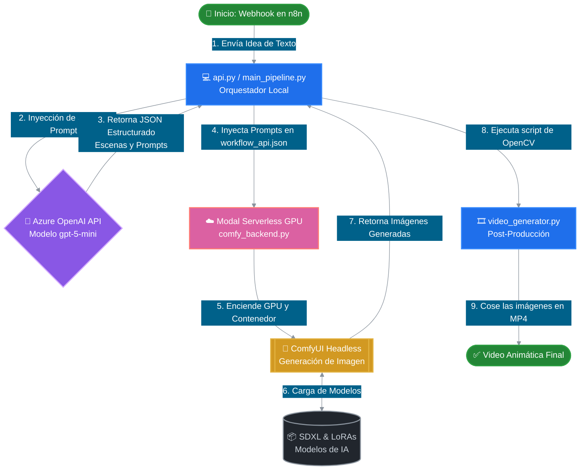

# 🎬 Pipeline Automatizado de Storyboards y Animáticas con IA


## 📌 Resumen
Este repositorio contiene un **Pipeline Automatizado de Storyboards y Animáticas**, diseñado para demostrar una integración avanzada de Modelos de Lenguaje Grande (LLMs) con flujos de trabajo de generación de imagen y video.

El sistema actúa como un Director de Cine IA autónomo. Toma una idea cruda en texto, utiliza un agente LLM estructurado para desglosarla en escenas cinematográficas precisas, y orquesta programáticamente una instancia de **ComfyUI** "Headless" (sin interfaz, desplegada en una nube de GPUs Serverless a través de Modal) para renderizar los cuadros del storyboard.

Finalmente, expone un Webhook (API en Flask) que puede ser activado por herramientas de automatización como **n8n** o Make, creando un flujo de trabajo de IA Generativa totalmente autónomo, ideal para estudios creativos y equipos de producción audiovisual.

---

## 🏗️ Arquitectura Completa del Sistema

A continuación se muestra el diagrama de la arquitectura. El flujo ilustra cómo viaja la información desde que el usuario envía su idea hasta que el video final es renderizado en la nube.



### Descripción Detallada de los Componentes:

1. **LLM Director (`llm_director.py`)**: 
   - Utiliza **Azure OpenAI** junto con Pydantic para garantizar *Salidas Estructuradas* (Structured Outputs).
   - Transforma una simple indicación del usuario en un payload JSON estricto que contiene: números de escena, descripciones, ángulos de cámara exactos y *prompts* positivos/negativos altamente optimizados para Stable Diffusion.

2. **Orquestador Headless de ComfyUI (`main_pipeline.py`)**:
   - Lee la plantilla base `workflow_api.json` exportada desde ComfyUI.
   - Modifica el grafo de nodos de manera dinámica, inyectando los prompts generados por el LLM en los nodos correctos (CLIPTextEncode).
   - Simula y prepara el envío del trabajo de procesamiento hacia el clúster de GPUs en la nube.

3. **Backend en la Nube (`comfy_backend.py`)**:
   - Infraestructura definida por código utilizando **Modal**.
   - Levanta contenedores Linux con GPUs T4 bajo demanda, instala las dependencias de PyTorch y arranca ComfyUI de forma *headless*, asegurando escalabilidad masiva y pago por segundo de uso.

4. **Endpoint de Automatización (`api.py` & `n8n_workflow.json`)**:
   - Expone todo el pipeline mediante una API REST en Flask.
   - Incluye un flujo de trabajo preconfigurado para `n8n` que permite conectar el pipeline a Slack, correo electrónico o sistemas CRM internos, creando un ecosistema de automatización real.

5. **Post-Producción (`video_generator.py`)**:
   - Un script apoyado en OpenCV que toma automáticamente las imágenes generadas cuadro por cuadro y las une en una presentación secuencial `.mp4` (Animática).

---

## 🚀 Guía de Inicio

### Requisitos Previos
- Python 3.10 o superior.
- Clave de API de Azure OpenAI (o llave estándar de OpenAI/Gemini).
- CLI de Modal instalada y autenticada (`modal token new`).

### Instalación

1. Clona este repositorio:
```bash
git clone https://github.com/fernando-pedernera/ai-storyboard.git
cd ai-storyboard
```

2. Crea un entorno virtual e instala las dependencias:
```bash
python -m venv venv
source venv/bin/activate  # En Windows usa: venv\Scripts\activate
pip install openai pydantic flask requests python-dotenv opencv-python numpy
```

3. Configura tus variables de entorno:
Crea un archivo `.env` en la raíz del proyecto con tus credenciales:
```env
AZURE_OPENAI_API_KEY=tu_clave_aqui
AZURE_OPENAI_ENDPOINT=https://tu-endpoint.services.ai.azure.com
AZURE_OPENAI_DEPLOYMENT_NAME=gpt-5-mini
API_VERSION=2024-02-15-preview
```

### Uso

**1. Ejecutar el Pipeline directamente (CLI):**
```bash
python main_pipeline.py
```
*Esto ejecutará el agente Director, generará los payloads JSON listos para inyección, simulará el entorno de GPU y procesará la lógica del storyboard.*

**2. Ejecutar el Servidor Webhook (Para n8n):**
```bash
python api.py
```
*Esto iniciará un servidor local en el puerto 5000, listo para recibir peticiones POST desde n8n, Make o Postman.*

**3. Generar la Animática (Video):**
```bash
python video_generator.py
```
*Este script tomará las imágenes generadas por ComfyUI y producirá un archivo `storyboard_pitch.mp4`.*

---

## 🎬 Aplicación en el Mundo Real
En un entorno de producción real, este pipeline ahorra cientos de horas a los artistas conceptuales y directores de arte. Al automatizar la fase de *Prompt Engineering* y la fase de renderizado visual de ComfyUI, un estudio creativo puede generar 10 storyboards visuales diferentes para el "pitch" de un cliente en cuestión de minutos, simplemente enviando un mensaje de Slack con la idea general.

## Licencia
MIT License
