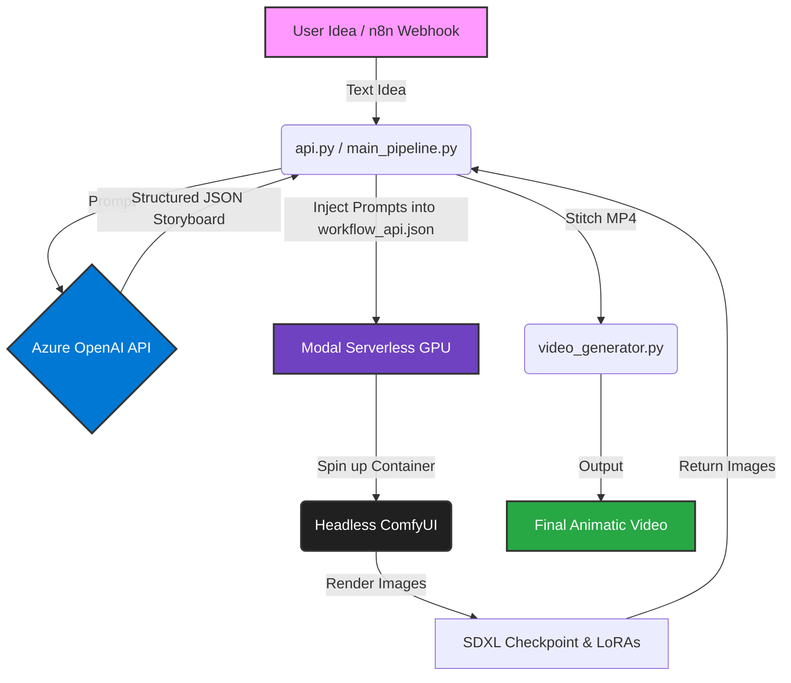

# AI Storyboard & Animatic Pipeline


## Overview
This repository contains an **Automated Storyboard & Animatic Pipeline**, designed to demonstrate advanced integration of Large Language Models (LLMs) with generative image and video workflows. 

The pipeline acts as an autonomous AI Movie Director. It takes a raw text idea, uses a structured LLM agent to break it down into cinematic scenes, and programmatically orchestrates a headless **ComfyUI** instance (deployed on a serverless GPU cloud via Modal) to render the storyboard frames. 

Finally, it exposes a Webhook (Flask API) that can be triggered by automation tools like **n8n** or Make, creating a fully autonomous Generative AI workflow suitable for creative studios and audiovisual production teams.

## 🏗️ Architecture



1. **LLM Director (`llm_director.py`)**: 
   - Uses **Azure OpenAI** with Pydantic for *Structured Outputs*.
   - Transforms a simple user prompt into a strict JSON payload containing specific camera angles, scene descriptions, and highly optimized positive/negative prompts for Stable Diffusion.

2. **ComfyUI Headless Orchestrator (`main_pipeline.py`)**:
   - Reads the standard `workflow_api.json` from ComfyUI.
   - Dynamically injects the LLM-generated prompts into the precise node graph.
   - Simulates dispatching the compute job to a cloud GPU cluster.

3. **Automation Endpoint (`api.py` & `n8n_workflow.json`)**:
   - Exposes the entire pipeline via a Flask REST API.
   - Includes an `n8n` workflow template to connect the pipeline to Slack, Email, or internal CRM systems.

## 🚀 Getting Started

### Prerequisites
- Python 3.10+
- Azure OpenAI API Key (or standard OpenAI/Gemini Key)
- Modal CLI authenticated (`modal token new`)

### Installation

1. Clone the repository:
```bash
git clone https://github.com/yourusername/ai-storyboard-pipeline.git
cd ai-storyboard-pipeline
```

2. Create a virtual environment and install dependencies:
```bash
python -m venv venv
source venv/bin/activate  # On Windows: venv\Scripts\activate
pip install openai pydantic flask requests python-dotenv
```

3. Configure environment variables:
Create a `.env` file in the root directory:
```env
AZURE_OPENAI_API_KEY=your_key_here
AZURE_OPENAI_ENDPOINT=https://your-endpoint.services.ai.azure.com
AZURE_OPENAI_DEPLOYMENT_NAME=gpt-4o-mini
API_VERSION=2024-02-15-preview
```

### Usage

**Run the CLI Pipeline:**
```bash
python main_pipeline.py
```
*This will execute the agent, generate the JSON payloads, and save the debug ComfyUI workflows in your root folder.*

**Run the Webhook Server:**
```bash
python api.py
```
*This starts a local server on port 5000, ready to receive POST requests from n8n or Postman.*

## 🎬 Real-World Application
In a real production environment, this pipeline saves hundreds of hours for conceptual artists and directors. By automating the prompt-engineering phase and the ComfyUI rendering phase, a creative studio can generate 10 different visual storyboards for a client pitch in a matter of minutes, simply by sending a Slack message.

## License
MIT License
